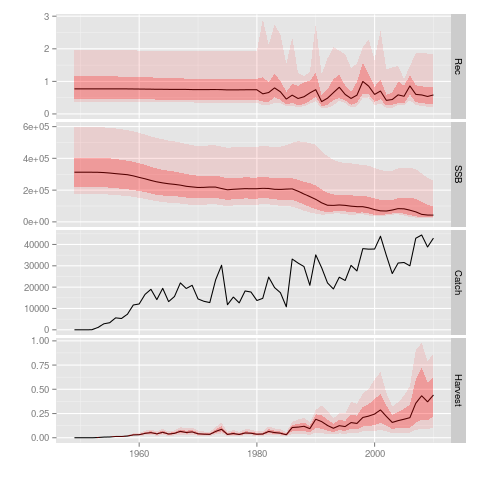
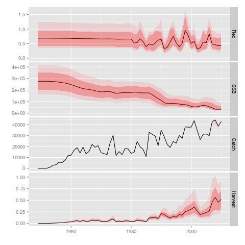

% Report of the Second Workshop on Management Strategy Evaluation
% Working Party on Methods - IOTC
% 23 October 2013

	DRAFT VERSION *11.NOV.2013*
	Please note this is a draft version that has not yet 
	been reviewed and approved by the WPM MSE Team

# Introduction

The Second Workshop on Management Strategy Evaluation (WK-MSE) of the Working Party on Methods (WPM) of the Indian Ocean Tuna Commission (IOTC) took place in the afternoon of 23 October 2013, coinciding with the Fifteenth Session of the Working Party on Tropical Tunas (WPTT), held in San Sebastian, Spain. Members of WPTT attending the meeting were invited to join in the WPM workshop and took active part in the discussions.

This short workshop was held to (1) review the current status of ongoing work on MSE for IOTC stocks, and (2) agree on the development of future activities. Of special relevance was the presentation to WPTT and WPM members of the recently initiated work on the development of Operating Models (OMs) for skipjack tuna, lead by Mr Nokome Bentley, working under contract with the Maldivian government.

# Presentations

The workshop was centered around a number of presentations covering both current work and planning of future activities.

## Using SS3 as a basis for Indian Ocean Albacore operating model: progress and problems (I. Mosqueira, EC JRC)

The current status of work on development of a set of OMs for Indian Ocean albacore was presented and discussed. Following the First Workshop on MSE of IOTC WPM, an operating model generated based on the existing stock assessment model was coded and tested. The model include a range of uncertainties in different structural factors considered to affect greatly the perception on the status of the stock, and to include the variability known to occur in nature that would affect forcasts or stock status and yield.

A final grid of scenarios covering all combinations of 7 factors, each with two or three levels, were incorporated, giving a total of 648 model runs.

Factor                                Levels
------                                -----------------
M, natural mortality at age           0.2, 0.3, 0.4
sigmaR, variance in recruitment       0.2, 0.4, 0.6
h, stock-recruit steepness            0.65, 0.8, 0.95
CV(CPUE), CV in LL CPUE series        0.1, 0.2, 0.3
ESS, weight to length data in lkhd    10, 20
TWN LL Q, change in catchability      1.00, 1.0025
TWN LL select, selectivity TWN LL     Logarithmic, Double normal

Table: Albacore OM grid for SS3 runs

The result of these runs presented much higher variability in population parameters that could be expected. For example, a number of runs returned estimates of SSB up to 10 times higher that the median value. This appears to be an indication of the model not being able to deal with the lack of information oin the data, or with a conflict in signals originating from the various data sources.

An initial solution has been to trim down the grid results to those within certain limits, in this case those runs where the final estimate of SSB (in 2010) is less or equal to 2.5 times the median of all runs.

This generated some time series with more reasonable uncertainty levels, but introduces a dgree f subjectivity in the choice of an *acceptable* level of departure from the median that is not easy to justify. It also impact negatively on the sampling procedure across the gird, as it is based on both prior expectations and likelihood values from the whole grid.

The agreement was that this discuss merits further work, and the option of assembling an OM for albacore based on tailor-made code that might better make best use of the available information was mentioned. The MSE team will discuss the issue further and proceed once an agreement has been reached.

- The MSE team will further ANALYSE the OM results and decide on a course of action.

An initial set of Management Procecdures for albacore was also discussed, and an outline of two possible candidates was drafted, and an be found in Appendx B.

- Presentation: [ALB_Progress-IM.pdf](https://github.com/iotcwpm/WPM/blob/master/meetings/WPM_WK2_OCT_2013@EAS/Presentations/ALB_Progress-IM.pdf?raw=true)

## Updated catch data for IO ALB (M. Herrera, IOTC)

The results of recent efforts at updating the catch statistics of Indonesia, and the effect of these changes on total and disagreggated catches of Indian Ocean albacore were presented. A report with the conclusions of the workshop that took place last June is available at the IOTC website, and a presentation was made noting the most important effects of this on the data being used to condition the albacore OMs.

Overall catch statistics have not being affected in a large scale, so the group considered that although future work will attempt to incorporate these revised figures, the changes are not large enough to invalidate the work carried out so far.

Another issue presented concerned the length sampling data reported by fleets of Taiwan China. Recent levels of sampling have increased dramatically for this fleet, achieving very high levels for some spatio-temporal strata. A preliminary analysis of these data, and comparison with the length distributions reported in previous periods appears to show some unexpected changes in time on the range of sizes being caught or landed by this fleet. A comparison with data from other longline fleets shows also surprising discrepancies in catch-at-length data for fleets operating in similar ways and areas.

The possible sources of these patterns in the data are not clear at this point, and a number of hypothesis were discussed, although further work will be needed to understand precisely the implications and reasons of the observed patterns.

The group discussed briefly the ways in which the conditioning of the operating models for albacore could attenpt to incorporate the uncertainty in this source of data, specially given that the progression of length-at-age is an important part of the likelihood of the population model currently applied. It was noted that one of the scneqrios already covered by the albacore OMs is that of giving less weight in the total likelihood to this data source.

- The group AGREED to explore further the possible uncertainties in the length-at-age data from Taiwan China, and how best to introduce it in the OM.

- Presentation: [ALB_Catch-MH.pdf](https://github.com/iotcwpm/WPM/blob/master/meetings/WPM_WK2_OCT_2013@EAS/Presentations/ALB_Catch-MH.pdf?raw=true)

## Progress and ideas for the development on Albacore operating Models in ICCAT (L. Kell, ICCAT)

Current work on albacore OMs carried out by ICCAT was presented. Given the relatively similar frames of operation in terms of objectives and reference points between ICCAt and IOTC, this presentation was particularly informative, although significant differences also exist in the way the respective management and scientific bodies are going about development and evaluation of manaement plans.

ICCAT has also used the existing stock assessment, in this casebased on  Multifan-CL, as a basis for the OM, while the MPs being tested generally used a biomass-dynamic model based on longline CPUE to provide advice on stock status.

- Presentation: [ALB_Progress-IM.pdf](https://github.com/iotcwpm/WPM/blob/master/meetings/WPM_WK2_OCT_2013@EAS/Presentations/ICCAT_ALB_MSE-LK.pdf?raw=true)

## Management strategy evaluation for the Indian Ocean skipjack tuna fishery : development of an operating model (N. Bentley, Trophia Ltd.)

The recently started work on the development of an OM for Indian Ocean skipjack was presented. This work will be lead by N. Bentley, under contract with the Maldivian Government, but will be assessed and evaluated by WPM as is any other analysis performed by any group member.

The presentation covered the proposed structure of the model, including the spatial and temporal disaggregation, the number of fleets, data sources and priors used for some parameters. The model is being developed in C++ and will be conditioned on the usual sources of data using McMC or SIR algorithms. Tagging data will be introduced via the existing estimates of Z-at-age for the PS fleet.

The model will be built around three areas, covering East and West Indian Ocean, and the Maldives archipelago. This should capture the most important elements in the spatial dynamics of stock and fleets, while still limiting the need for detailed movement information, which is still very scarce.

The group welcomed this new development and was specially interested in the approach taken given the lack of a solid population model used for stock assessment. The conditioning of this model to the existing data was considered to be an essential element, given the known limitations in some key data sources.

A number of suggestions were made to the developer, many of them related to the possible difficulties at extracting enough information on the spatial dynamics from the available data, and the possibility of comparing a range of movement scenarios to see the importance of this factor in the overall results.

All code developed for this model is in the process of being uploaded to the IOTC WPM repository.

- Chair will work with N. Bentley to include skipjack OM code in IOPTCWPM repository at (http://github.com/iotcwpm/).

- Presentation: [SKJ_OM-NB.pdf](https://github.com/iotcwpm/WPM/blob/master/meetings/WPM_WK2_OCT_2013@EAS/Presentations/SKJ_OM-NB.pdf?raw=true)

## FLBEIA, a package for bio-economic evaluation of fisheries management plans (D. Garcia, AZTI Tecnalia)

A presentation was carried out on the ongoing development and application of an R/FLR package for simplified implementation of bio-economic simulations able to assess the economic impact of alternative regulations and management regimes. Although the work has been carried out for inmedate application in European fisheries, the framework is generic enough to accomodate other fishery systems. The availability of detailed economic data, so as to be able to assess the economic performance of different fleets, is obviously a limiting factor in the use of this type of analysis, but the group recognized the interest of seeing this kind of evaluation being carried out. Future situations in which MSE work in IOTC might need to move towards limited calculation of associated economic costs and benefits of certain management options was discussed. For example, the value of intensive tagging programmes, able to provide fishery-independent estimates of stock status, 

- Presentation: [FLBEIA-DG.pdf](https://github.com/iotcwpm/WPM/blob/master/meetings/WPM_WK2_OCT_2013@EAS/Presentations/FLBEIA-DG.pdf?raw=true)

## Draft outline of MSE information session at IOTC SC 2014 (I. Mosqueira, EC JRC)

The chair and vice-chair of WPM have been asked by the IOTC Secretariat and the chair of the SC to prepare and carry out a training session on MSE during the next meeting of IOTC SC, 2-6 December 2013. A draft outline of the session was presented and briefly discussed. The proposed training is to be divided on three 30' sessions, and will present members of IOTC SC with a basic introduction to MSE, the essential of its mechanics, and allow them to interact with a simple example of MSE so they are able to explore some of the trade-offs, and understand the kind of outputs these exercises generate.

The draft outline of the session can be found in Appendix A, and the development of the material is to be carried out over the next few weeks by the chair and vice-chair of WPM with the help of IOTC Secretariat and other members of the team.

- Repository: [MSE-Training@github](https://github.com/iotcwpm/MSE-Training)

## Possible work in support of CPUE workshop outcomes (R. Sharma, IOTC)

A summary of the results of the 1st Workshop on CPUE Standardization, that took place 21-22 October in AZTI Tecnalia, Pasaia, Spain, highlighted the issues under discussion that could benefit from future work involving members of the WPM. The possibility of carrying out a simulation exercise that better understand the biases and errors in stock assessment introduced by different factors affecting the standardized COUE series was considered. The final form of this exercise will have to be discussed and decided once the results of the CPUE workshop have been circulated.

- The chair will DISCUSS with IOTC Secretariat and DRAFT a plan for a set of analysis in support of the CPUE workshop outcomes.

## Update on the t-RFMO Working Group on MSE (L. Kell, ICCAT)

The co-ordinator of the t-RFMO Working Group on MSE, set up as part of the Kobe process, presented the status of activities and future ideas for the group. A webiste is eing set up, hosted at the tuna-org website ((http://tuna-org.org/mse.htm)), that will serve as focal point for MSE actitivies across the various tuna RFMOs.

The interest in developing some hierarchical MSE for albacore tuna across the avrious oceans was mentioned as a first project this Working Group could tackle. Discussions are be started on how this could be carried out, and the co-ordinator will be in touch with the relevant chairs of working groups to get this project started.

The group expressed its interest in participating in this and future activities.

- Chair to CONTACT t-RFMO co-ordinator on albacore MSE.

# Other issues

# Activities in 2013

## Workplan 2014

- Chair and vice-chair to work on a draft workplan for 2014 to be presented at SC meeting, December 2013.

\newpage
\appendix

# Demonstration session on Management Strategy Evaluation

\renewcommand{\thesubsection}{}
\renewcommand{\thesubsubsection}{}

## OBJECTIVES

- Introduce SC members to MSE
- Explain fundamental concepts
- Show a running example
- Allow them to play with it

## ORGANIZATION

- To take place at IOTC SC16 2013, Busan, Korea
- To be run over three 30' sessions
- 2-3 demonstrators
- Simple simalutions, pre-run

## Session 1. Introduction to MSE

### 1. PRESENTATION: In a nutshell, what is MSE?

### 2. PRESENTATION: The components of the fishery system

- The "real" population
- The stock
- The fleets
- The scientific advice process
- The management system

## Session 2. Running and inspecting an MSE

### DEMO: Simple MSE example in FLR with user interface front end

- Run projections under different management scenarios
- Compare alternative OM options
- Effects of uncertainty
- Select a winning HCR

## Session 3. Simulating the fishery system

### DEMO: How can it be done? Disecting the MSE

- Data collection
- Stock status
- Harvest control rule
- Implementation

# DRAFT Experimental Management Procedures for Indian Ocean albacore

##  BACKGROUND

### IOTC Resolution 13/10
- GREEN: maintain the stocks with a *high probability* within this quadrant.
- ORANGE: aim at ending overfishing with a *high probability* in *as short a period as possible*.
- YELLOW: aim at rebuilding these stocks in *as short a period as possible*.
- RED: end overfishing with a *high probability* and rebuild the biomass in *as short a period as possible*.

## OBJECTIVES

Possible interpretation of risks associated with target and limit reference points

- P(SSB >= SSB@MSY) > 60%
- P(F <= F@MSY) > 60%

- P(SSB > SSBLim) > 95%
- P(F < FLim) > 95%

## TARGETS

- SSB = SSB@MSY
- F = F@MSY

## LIMITS

- SSBLim: 0.4 * SSB@MSY
- FLim: 1.4 * F@MSY

## PERFORMANCE MEASURES

- P(SSB_y >= SSB@MSY)
- P(SSB_end >= SSB@MSY)
- P(F_y >= F@MSY)
- P(F_end >= F@MSY)
- Median C, CV C

## HCRs

### BD Model-based HCR

- Biomass dynamics SA
- IF SSB_y < 0.90 * SSB@MSY
	- F_y+1 = F(SSB y+5 > SSB@MSY)
- F_y+1 -> C_y+1
- E(C_y+1)

### CPUE-based indicator HCR

- Linear trend of last 5 years
- Slope < 0 w/ alpha=0.2, then
	- C_y+1 = C_y * 0.80
